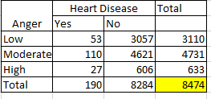

```{r setup, include=FALSE}
knitr::opts_chunk$set(echo = TRUE)
```

### Question 1 : Horse Race

Given: Number of categories n = 8

Total races = 144

Lets set up our hypotheses as:

Null H(0) = Starting position does not affect the probability of horse wining the race.

Alternate H(1) = Starting position does affect the probability of horse winning the race.

```{r}
n <- 8
total <- 144
```

Observed:

```{r}
observed <- c(29,19,18,25,17,10,15,11)
expected <- c(rep(144/8, times = 8))
```

we know that degrees of freedom is given by: number of categories minus 1. Therefore,

```{r}
dof <- n - 1 
```

Lets perform both Likelihood ration and Pearson test to find the p-value:

i.Likelihood:

```{r}
likelihood <- 2* sum(observed * log(observed/expected))
p <- 1- pchisq(likelihood,df=dof)
print(paste("P-value obtained using loglikelihood test is" ,p))
```

Pearson:

```{r}
pearson <- sum((observed - expected)^2 /expected)
p <- 1- pchisq(pearson,df=dof)
p
```

The p-value obtained is 0.023 and 0.022 from the above tests, which means that the given data is not compatible with the null hypotheses, meaning, Yes, starting position does affect the horse from winning the race, but can we conclude based on the number of samples we have? and the assumed statistical significance threshold of 0.05? to a certain extent yes, as the sample size is moderately good, but I would like to have more data, few hundred races to be more confident.

### Question 2: Recessive and Dominant Tomatoes

Given : If each parent has a dominant and a recessive gene, then the probability of their offspring displaying a recessive trait is 1/4.
Similarly, the probability of offspring displaying a dominant trait if one of the gene is dominant is 3/4.
Because the traits are independent, the probabilites for each combination of genes is given by:

#### Question 2A:

For a tall cut leaf offspring, the probability E1 is 3/4 \* 3/4 = 9/16

Similarly for a tall potato leaf offspring E2, the probability is 3/4 \* 1/4 = 3/16

E3 , Dwarf cut leaf offspring : 1/4 * 3/4 = 3/16

E4 = dwarf potato leaf offspring : 1/4 * 1/4 = 1/16


```{r}
E1 <- 9/16
E2 <- 3/16
E3 <- 3/16
E4 <- 1/16
```

#### Question 2B:

```{r}
n<-1611
expected <- c(n*E1,n*E2,n*E3,n*E4)
```

Given:

```{r}

o1 <- 926
o2 <- 288
o3 <- 293
o4 <- 104

observed<- c(o1,o2,o3,o4)
```

Degrees of freedom is  4 (categories) minus 1.

```{r}
dof <- 4-1
```

likelihood :

```{r}
likelihood <- 2 * sum(observed*log(observed/expected))
1-pchisq(likelihood,df=dof)
```

Pearson:

```{r}
pearson <- sum((observed - expected)^2 /expected)
p <- 1- pchisq(pearson,df=dof)
p
```

The p value obtained is not tiny, hence out data is compatible with the null hypotheses. 

### Question 3: Sandflies in Panama :

Given the values, lets calculate our expected proportions:

```{r}
n<- 521
total_males <- 298
total_female<- 223

exp_male_3_ft <- 521 * (298/521) * ((173+150)/521)
exp_female_3_ft <- 521 * (223/521) * ((150+173)/ 521)
exp_male_35_ft <- 521 *(298/521) * ((125+73)/521)
exp_female_35_ft <- 521 * (223/521) * ((125+73)/521)

expected <- c(exp_male_3_ft,exp_female_3_ft,exp_male_35_ft,exp_female_35_ft)
observed <- c(173,150,125,73)

dof <- 4 - 2 - 1 #categories - estimated P -1 

```

Likelihood ration :

```{r}
G2 <- 2 * sum(observed * log(observed/expected))
1 - pchisq(G2, df=dof)
```

Pearson's ratio:

```{r}
X2 <- sum((observed - expected)^2/expected)
1 - pchisq(X2, df=dof)
```
From both of our tests, we can see that our P-value is less, but not tiny. There is some evidence that the sex ratio of Panama sand flies does vary with height. Perhaps more data would help us be more confident.


### Question 4: Hodgkin's disease

Given:


```{r}
n<- 538
observed <- c(74,18,12,68,16,12,154,54,58,18,10,44)
```

```{r}
positive <- (74 + 68 + 154 + 18) / 538
LP  <- (74 + 18 + 12) / 538

positiveLP <- (n * positive * LP)
positiveLP
```

```{r}
NS <- (68 + 16 + 12)/n
positiveNS <- n * positive * NS
positiveNS
```

```{r}
MC <- (154 + 54 + 58) / n
positiveMC <- n * positive * MC
positiveMC
```

```{r}
LD <- (18 + 10 + 44)/n
positiveLD <- n * positive * LD
positiveLD
```

```{r}
partial <- (18 + 16 + 54 + 10)/n
partialLP <- n * partial * LP
partialLP
```

```{r}
partialNS <- n * NS * partial
partialNS
```

```{r}
partialMC <- n * MC * partial
partialMC
```

```{r}
partialLD <- n * LD * partial
partialLD
```

```{r}
None <- (12 + 12 + 58 + 44) / n
NoneLP <- n * LP * None
NoneLP
```

```{r}
NoneNS <- n* NS* None
NoneNS
```

```{r}
NoneMC <- n * MC * None
NoneMC
```

```{r}
NoneLD <- n * LD * None
NoneLD
```

```{r}
expected <- c(positiveLP,partialLP,NoneLP,positiveNS,partialNS,NoneNS,
              positiveMC,partialMC,NoneMC,positiveLD,partialLD,NoneLD)
expected
```

```{r}

# (In general, when testing independence for a table of counts with r rows and c columns, #degrees of freedom is (r - 1) × (c - 1). See Trosset p. 343.)

r <- 4
c <- 3
dof <- (r-1) * (c-1)
dof
```

Pearson's test:

```{r}
X2 <- sum((observed - expected)^2/expected)
1 - pchisq(X2, df=dof)
```

Likelihood test:

```{r}
G2 <- 2 * sum(observed * log(observed/expected))
1 - pchisq(G2, df=dof)

```
The p value obtained is tiny. Hence our data is incompatible with null hypotheses meaning that there is in fact evidence with the fact that patient's response to Hodgkin treatment does vary by histological type.


#### Question 5: Anger vs Heart Disease.

Let's draw the contingency table based on the information provided:



```{r}
n <- 8474

observed <- c(53,3057,110,4621,27,606)
heart<- 190/n
noHeart <- 8284 / n
low_anger <- 3110/n
mod_anger <- 4731/n
high_anger <- 633/n

low_heart <- n * heart * low_anger
low_heart
```

```{r}
low_no_heart <- n * low_anger * noHeart
low_no_heart
```

```{r}
mod_heart <- n * mod_anger * heart
mod_heart
```

```{r}
mod_no_heart <- n * mod_anger * noHeart
mod_no_heart
```

```{r}
high_heart <- n * heart * high_anger
high_heart
```

```{r}
high_no_heart <- n * noHeart * high_anger
high_no_heart
```

```{r}
expected <- c(low_heart ,low_no_heart,mod_heart,mod_no_heart,high_heart,high_no_heart)
expected
```

```{r}
r <- 3
c<- 2
dof <- (r-1) * (c-1)
dof 
```
Pearson's test:

```{r}
X2 <- sum((observed - expected)^2/expected)
1 - pchisq(X2, df=dof)

```

```{r}
G2 <- 2 * sum(observed * log(observed/expected))
1 - pchisq(G2, df=dof)

```
From our tests, its kinda clear that the data is not compatible with the null hypotheses, and there is some evidence that anger and heart disease may be related.

Alternatively :


```{r}

low_anger <- c(3110 - 53, 53)
moderate_anger <- c(4731 - 110, 110)
high_anger <- c(633 - 27, 27)

# Create the contingency table
data_matrix <- matrix(c(low_anger, moderate_anger, high_anger), nrow = 3, byrow = TRUE)
rownames(data_matrix) <- c("Low Anger", "Moderate Anger", "High Anger")
colnames(data_matrix) <- c("No Heart Disease", "Heart Disease")

# Print the contingency table
print(data_matrix)
chi_square_test <- chisq.test(data_matrix)
# Print the results
print(chi_square_test)
```
#### Question 5b: Conclusion:

Was this even a randomized experiment? what were the age groups of the experiment units of this study? How was the data sampled? Sure, we did find a p-value that was less than 0.05, and the test did tell us that there might be some relation between anger and heart disease. But, one cannot conclude that anger affects the chance of getting heart disease. This is not a causal relationship that we are trying to prove. Confounding variables such as age, activity, diet etc should be considered in the study. Randomized experiment is the way to go.


### Question 6: Goals

```{r}
data <- read.csv("epl2223.csv")
```

Lets find the total goals scored by the teams in 380 games:

#### 6a.

```{r}
TotalGoals <- data$FTHG + data$FTAG
length(TotalGoals)
```

#### Question 6b:

```{r}
table(TotalGoals)
```
#### Question 6c:

Mean number of Total Goals:

```{r}
m <- mean(TotalGoals)
m
```
#### Question 6d:

Find the observed and expected counts using 0, 1, 2, 3, 4, 5, 6, 7 or more categories

```{r}
lambda <- m
observed <- c(23,70,87,79,57,31,18,15)
probs <- c(dpois(0:6, lambda), 1 - ppois(6, lambda))
expected <- 380 * probs
expected
```
```{r}
sum(expected)
data.frame(goals = 0:7, observed, expected)
```

These should add up to 380.
```{r}
sum(expected)
```


### Question 6e:

Pearson's:

```{r}
x2 <- sum((observed - expected)^2 / expected)
x2
```
```{r}
dof<- 8 - 1 - 1
1 - pchisq(x2, df = 6)
```

Likelihood :

```{r}
g2 <- 2 * sum(observed * log(observed / expected))
g2
```
```{r}
1 - pchisq(g2, df = 6)
```
In both the cases, we can see that the p-value is not tiny. So we can conclude that the data is compatible with null hypotheses and does follow Poisson's Distribution.

